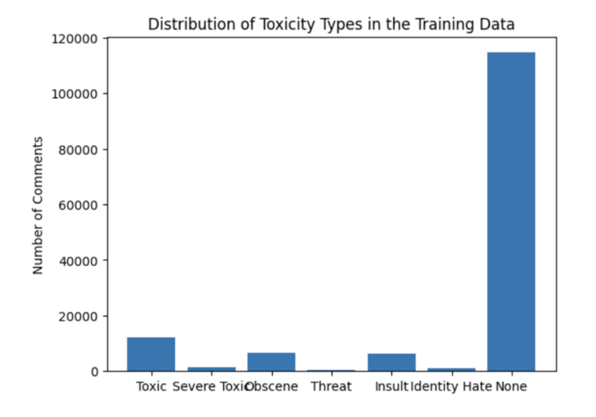
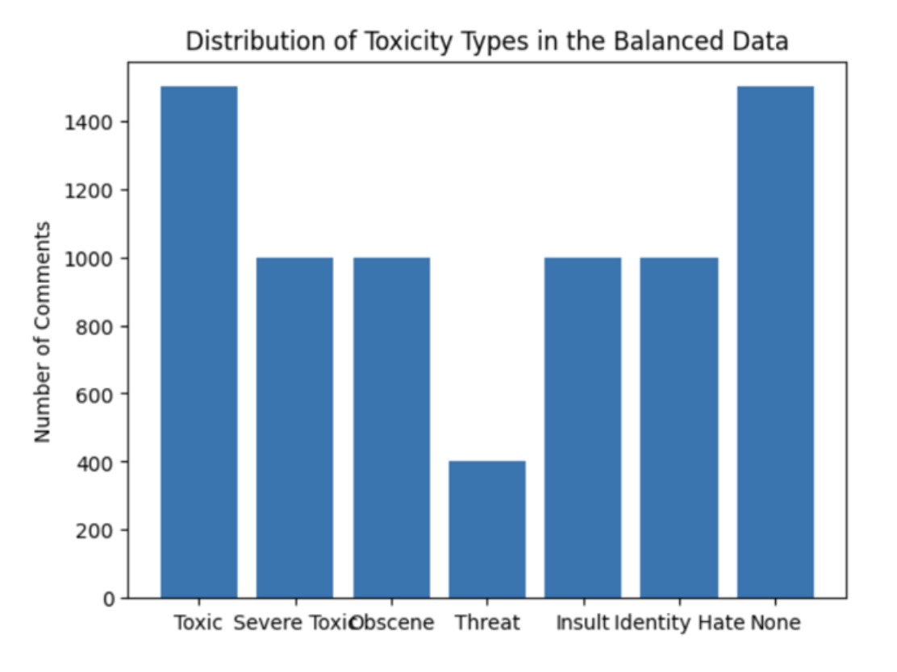
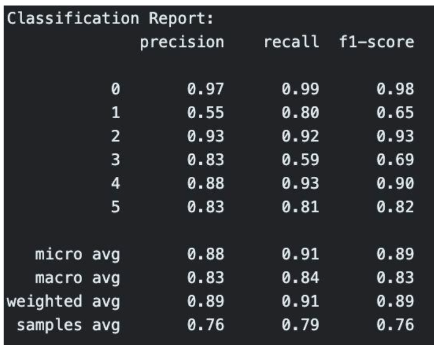

# Notebook 3 - LLaMA 7B 4
For the final part of our project, we attempted to make use of LLMs on the Kaggle dataset for toxicity classification. To address the class imbalance, we decided to sift out a carefully selected subset of 7,400 examples, aiming to balance the dataset and improve generalization across various toxicity classes. The decision to downsize the training dataset was a practical one, considering limitations in computational resources. The following are visualizations of the original and refined data distributions:

For a comprehensive evaluation, the testing dataset comprised 350 samples, ensuring a balanced representation of each toxicity class. Each class had 50 examples, with an additional 50 labeled as 'none.' This intentional testing strategy facilitated a detailed assessment of the model's performance, accounting for potential overlaps where a single example could belong to multiple classes.
In the fine-tuning phase, we employed the LLaMA 7B-chat model, utilizing Parameter-Efficient Fine-Tuning (PEFT) to streamline the process and reduce parameter updates, accelerating training and cutting computational costs. The LLama 2 variant with 7 billion parameters posed GPU VRAM challenges, which were addressed by implementing QLORA (Quantized LORA) to reduce memory requirements through quantization. To conclude fine-tuning, we merged LoRA weights with the base model using the PEFT library, pushing the final weights and tokenizer to the Hugging Face Hub for community sharing.
Notably, the model initially struggled with toxic prompts, adhering to guidelines and refusing classification. Post fine-tuning, it adeptly processed and categorized these prompts, displaying the potential of fine-tuning to enhance the model's versatility and effectiveness across diverse requests.
During testing, data with a maximum output length of 350 was fed into the model, to manage generation time effectively. Precision, recall, accuracy, and F1-scores, alongside visualizations using confusion matrices and AUC-ROC curves, were utilized for a comprehensive evaluation.

Despite training on a relatively small number of examples per class (400-1000), the model showcased exceptional performance on the testing set. Precision and recall for most classes ranged between 80-90%, yielding an overall accuracy of 90%. However, the 'threat' class exhibited comparatively lower performance, likely due to a limited number of training examples compared to other classes.
The fine-tuned model, as a result, showcased outstanding accuracy, F1 scores, precision, and recall, effectively navigating challenges posed by imbalanced data. A pivotal aspect for improvement is enhancing threat classification by acquiring more ‘threat’ data for fine-tuning.
The combination of Quantization and PEFT, along with the robust capabilities of LLAMA-2, displays the remarkable potential of LLMs in handling such tasks. Beyond the technical achievements, this project sheds light on the potential use such models for practical applications in real-world scenarios, particularly in toxicity classification and analogous challenges.
 
# Conclusion
This project has been a significant learning opportunity for all members of our group! The exploration of Naive Bayes, LSTM, and the LLaMA 7B 4 model not only deepened our understanding of toxicity classification but also exposed us to the complexities and nuances of implementing diverse machine learning approaches. Each phase of the project brought unique challenges that demanded creative problem-solving and critical thinking.
While each approach contributed valuable perspectives, the LLaMA 7B 4 model emerged as the standout solution, demonstrating remarkable efficacy in handling the challenges inherent in online communication. Its superior performance across precision, recall, accuracy, and F1-scores underscores its potential for practical applications in real-world scenarios. The LLaMA 7B 4 model's ability to navigate imbalanced data and capture nuanced patterns positions it as a robust tool for toxicity classification.
Moving forward, our commitment to continuous exploration remains steadfast, particularly in the realm of advanced models and data enrichment strategies. We recognize the evolving nature of online communication and the need for adaptive, cutting-edge solutions. As we strive for further improvements, our focus extends to refining the accuracy and robustness of toxicity classification systems. This involves ongoing research into state-of-the-art models, embracing innovative approaches, and exploring opportunities for data augmentation and diversity to enhance the model's ability to generalize across various toxicity classes. Our journey underscores the dynamic nature of the field, urging us to remain at the forefront of advancements to ensure the effectiveness of our solutions in addressing the ever-evolving challenges of toxicity in online spaces.

# Future Research Directions**:

The evolving landscape of large language models (LLMs) introduces challenges in terms of model size, memory requirements, and efficient deployment. Two recent breakthroughs pave the way for exciting future research in text classification:

* **Post-Training Quantization with QuIP#**

* Recent work from Cornell introduces QuIP#, a novel approach that combines lattice codebooks with incoherence processing to achieve state-of-the-art 2-bit quantized language models. LLMs, such as Llama 2 with its 70 billion parameters, demand substantial memory resources. Post-training quantization compresses model weights into lower precision formats, significantly reducing memory requirements. For instance, QuIP# demonstrates the potential to close the gap between 2-bit quantized LLMs and unquantized 16-bit models. This breakthrough opens avenues for future research in optimizing memory-efficient deployment of large language models, potentially allowing even massive models to run on standard GPUs.

* **Mistral's Mixture of Experts (MoE) Model**

* Mistral AI's release of an MoE model, a scaled-down version of GPT-4 with 8 experts, presents an intriguing avenue for exploration. Mixture of Experts is a technique that divides complex tasks into smaller, specialized sub-tasks, each handled by an expert. Mistral's MoE model, with only 2 experts used for the inference of each token, showcases a more efficient architecture. The model achieves a significant reduction in parameters compared to GPT-4 while maintaining a comparable context size. Future research could delve into the application of MoE techniques for enhancing the efficiency and accuracy of text classification tasks. Understanding how to leverage the expertise of specialized models for different aspects of text classification and generation may lead to significant advances in text classification particulary on hard datsets like Toxicity classification

In summary, these breakthroughs in post-training quantization and MoE architectures provide exciting prospects for advancing text classification models, addressing challenges posed by large model sizes and paving the way for more memory-efficient and specialized language models